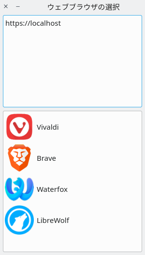

# Browser Selector

Simple tool to open a dialog which prompts for the browser to open
when applications request to open web links.



## Installation

Place the `browser-selector.desktop` file into a directory scanned by XDG.

Example: `~/.local/share/applications`

Get the current default browser:
 - `xdg-mime query default x-scheme-handler/http`
 - `xdg-mime query default x-scheme-handler/https`

Set Browser Selector as default browser:
 - `xdg-mime default browser-selector.desktop x-scheme-handler/http`
 - `xdg-mime default browser-selector.desktop x-scheme-handler/https`

Test configuration with:
 - `xdg-open http://localhost`
 - `xdg-open https://localhost`

## Configuration

Location: `$XDG_CONFIG_HOME/browser-selector.yml` (`~/.config/browser-selector.yml`)

**Example configuration:**

```yml
- displayName: Vivaldi
  command: /usr/bin/vivaldi
  xdgIconName: vivaldi

- displayName: Brave
  command: /usr/bin/brave-bin
  xdgIconName: brave-bin

- displayName: Waterfox
  command: /usr/local/bin/waterfox
  xdgIconName: waterfox

- displayName: LibreWolf
  command: /usr/bin/librewolf
  xdgIconName: librewolf
```
